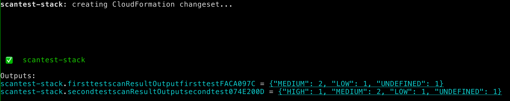

# Unmaintained, this does not work with the new asset naming convention used in cdkv2. Maybe I'll update it one day. Enhanced ECR scanning kind of replaces this (as released by AWS)

# CDK ECR Asset Scanner

The CDK ECR Asset Scanner is a custom L3 `ScannedDockerImageAsset` construct that builds and uploads your container image assets to ECR. After pushing, it will return the vulnerability report status in a Stack Output. In that way, it gives crucial and important security related information directly back to the engineer working with the stack. It aims to improve security insight while working with AWS CDK.

As stated before, `ScannedDockerImageAsset` is a custom L3 construct in the AWS Construct Library that combines the following L2 Constructs:

- DockerImageAsset
- A Custom Resource backed by a Lambda function
- Stack outputs

Because it just combines existing Constructs, this means the `ScannedDockerImageAsset` is a very stable L3 construct, not deemed experimental.



## USAGE

Run `npm i cdk-ecr-asset-scanner`.

Just add the `ScannedDockerImageAsset` to your imports, and use it exactly like you would a normal `DockerImageAsset`. It will do all the heavy lifting under the hood by itself. Make sure cdk peer dependencies are correct as usual, but npm will point those out (> 1.118.0 cdk versions)

Example (ts):

```ts
import { ScannedDockerImageAsset } from 'cdk-ecr-asset-scanner';
import * as path from 'path';
...

const env = {
  region: process.env.CDK_DEFAULT_REGION,
  account: process.env.CDK_DEFAULT_ACCOUNT,
};

const app = new cdk.App();

export class TestStack extends cdk.Stack {
  constructor(scope: cdk.Construct, id: string, props?: cdk.StackProps) {
    super(scope, id, props);

    // Image without scan
    // const image3 = new DockerImageAsset(this, "zzz", {
    //   directory: path.join(__dirname, "../src/"),
    // });

    // Image with scan
    const image = new ScannedDockerImageAsset(this, "zzz", {
      directory: path.join(__dirname, "../src/"),
    });
    const image3 = ecs.ContainerImage.fromDockerImageAsset(image);

    const taskDefinition = new ecs.FargateTaskDefinition(
      this,
      "test-task-definition",
      {
        memoryLimitMiB: 2048,
        cpu: 1024,
      }
    );
    taskDefinition.addContainer("container_example_three", {
      image: image3,
      environment: {
        TEST_VAR: "THREE",
      },
      logging: new ecs.AwsLogDriver({
        streamPrefix: "three",
      }),
    });
  }
}
new TestStack(app, "hh-stack", { env });
```

## Availability

- Typescript / JS
- Python
